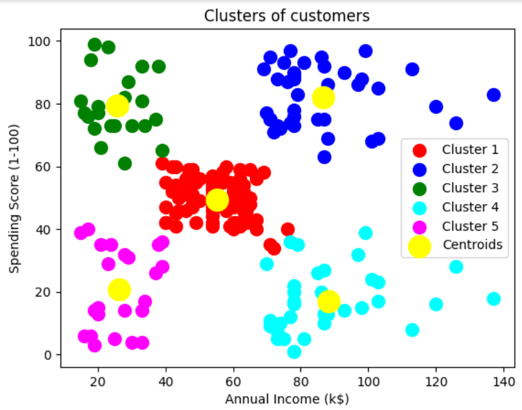

# PRODIGY_ML_02 - Customer Segmentation with K-Means Clustering

This project is part of the **Machine Learning Internship** offered by **Prodigy InfoTech**.

---

## 📊 Task Objective

Implement a **K-Means Clustering** algorithm to segment customers of a retail store based on:

- **Annual Income** (`Annual Income (k$)`)
- **Spending Score** (`Spending Score (1-100)`)

📌 Dataset Source: [Kaggle - Customer Segmentation Tutorial in Python](https://www.kaggle.com/datasets/vjchoudhary7/customer-segmentation-tutorial-in-python)

---

## 🔧 Tools & Libraries Used

- Python 🐍  
- Pandas  
- NumPy  
- Matplotlib  
- Seaborn  
- Scikit-learn  
- Google Colab

---

## 📈 Approach

- Loaded and cleaned the dataset  
- Analyzed distributions of income and spending score  
- Applied the **Elbow Method** to determine the optimal number of clusters  
- Trained a **K-Means Clustering** model  
- Visualized customer clusters using scatter plots  
- Interpreted segmentation results

---

## ✅ Results

- **Optimal Clusters Identified**: `5`  
- Customers segmented into distinct groups based on income and spending behavior  
- Visual analysis revealed meaningful clusters representing different customer profiles

---

## 📁 Files

- `PRODIGY_ML_02.ipynb` → Full implementation notebook  
- `README.md` → Project overview  
- `output2.png` → Visualization of customer clusters

---

## 🔗 Open in Google Colab

---

## 🚀 Output Preview

---

## 📚 Learning Outcomes

- Gained hands-on experience with **unsupervised learning**  
- Learned how to apply **K-Means clustering** in Python  
- Interpreted customer segments using **real-world data**

---

## 📝 Note

✅ This repository is maintained as part of the **Prodigy InfoTech Machine Learning Internship**.

---
